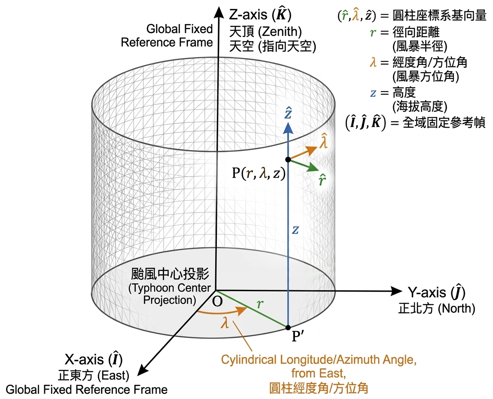

# Cylindrical Coordinate Transformation : Momentum Equation 

+++

## 目標

**將[動量方程式](https://derek1403.github.io/PC-NTU/Advanced-Atmospheric-Dynamics/_build/html/lecture/week1/week1.html#momentum-equation-navier-stokes)**

$$
\frac{D \vec{V}}{D t} + f\hat{k}\times \vec{V} = -\frac{1}{\rho}\nabla P - g\hat{k} + \text{Friction}
$$

**寫在圓柱座標系 $(r, \lambda, z)$**

$$\begin{aligned}
\text{[u 徑向]} \quad &\frac{Du}{Dt} - \frac{v^2}{r} - fv = -\frac{1}{\rho} \frac{\partial P}{\partial r} + \text{RHS}_{\hat{r}} \\
\text{[v 切向]} \quad &\frac{Dv}{Dt} + \frac{uv}{r} + fu = -\frac{1}{\rho r} \frac{\partial P}{\partial \lambda} + \text{RHS}_{\hat{\lambda}} \\
\text{[w 垂直]} \quad &\frac{Dw}{Dt} = -\frac{1}{\rho} \frac{\partial P}{\partial z} - g + \text{RHS}_{\hat{z}}
\end{aligned}$$

## 操作流程

推導方法的標準作業流程（SOP）流程圖：

**[Step 1] 定義全域常數 (Global Constants)**

👉 在太空中建立絕對不會動的直角參考座標系 $(\hat{I}, \hat{J}, \hat{K})$。

**[Step 2] 實作局部物件 (Local Basis Objects)**

👉 將圓柱座標的局部基底 $(\hat{r}, \hat{\lambda}, \hat{z})$ 投影到絕對座標系上。

**[Step 3] 呼叫時間導數方法 (Chain Rule)**

👉 計算基底向量隨流體移動時的「旋轉變化量」 $\frac{D\hat{r}}{Dt}, \frac{D\hat{\lambda}}{Dt}, \frac{D\hat{z}}{Dt}$。

**[Step 4] 執行總速度展開 (Product Rule)**

👉  對 $\vec{V} = u\hat{r} + v\hat{\lambda} + w\hat{z}$ 執行全質導數。

**[Step 5] 靠慮其他外力(科氏力)**

👉 計算 $f\hat{z} \times \vec{V}$ 並將所有項整合。

---

+++

## **[Step 1] 定義全域常數 (Global Constants)：建立絕對直角參考座標系**

流體質塊在颱風內移動時，它的「距離中心距離、跟東方的夾角、距地表高度」每走一步都在改變，如果我們要對這些會變動的局部向量（$\hat{r}, \hat{\lambda}, \hat{z}$）進行微積分，我們必須先架設一個 **「上帝視角」** ——一個絕對不會因為經緯度改變而彎曲、旋轉的框架。

這就是我們現在要建立的**全域直角座標系 $(\hat{I}, \hat{J}, \hat{K})$**。

### 1. 座標系的幾何定義 (The Setup)

我們將原點 $(0,0,0)$ 釘在**颱風地表的中心**。接著，伸出三根互相垂直且筆直的軸：
* $\hat{K}$ (Z-axis)：垂直往上，穿過颱風眼指向天空。
* $\hat{I}$ (X-axis)：水平指向某個絕對固定的參考方向（例如正東方）。
* $\hat{J}$ (Y-axis)：水平指向與 X 軸垂直的絕對方向（例如正北方）。

### 2. 核心數學性質 (The Mathematical Property)

因為這三根軸是筆直地穿出圓柱，無論流體質塊今天是在近的東邊還是轉到遠的西邊，**這三根軸的方向在相對於圓柱的空間中永遠不會改變**。

因此，它們的全質導數（時間變化率）嚴格為零：

$$
\frac{D \hat{I}}{Dt} = 0, \quad \frac{D \hat{J}}{Dt} = 0, \quad \frac{D \hat{K}}{Dt} = 0
$$

**老師的特別提醒（物理意義）：????????**
為什麼我們要把它固定在颱風中心，而不是固定在遙遠的太空中？
因為在我們的大氣動力方程式 $\frac{D \vec{V}}{Dt} + 2\vec{\Omega} \times \vec{V} = -\frac{1}{\rho}\nabla P$ 已經有 $2\vec{\Omega} \times \vec{V}$ 這個科氏力項了，這個科氏力項已經幫我們處理了「地球自轉」帶來的假力。因此，我們的座標系 $(\hat{I}, \hat{J}, \hat{K})$ 只需要跟著地球一起轉就好，我們後續計算的 $\frac{D}{Dt}$ 都是 **「相對於颱風中心」** 的變化，這樣可以完美分離出「科氏力」與「幾何曲率產生的度量項」！

+++

## **[Step 2] 實作局部物件 (Local Basis Objects)**

我們的目標是把局部的 $(\hat{i}, \hat{j}, \hat{k})$ 寫成絕對座標 $(\hat{I}, \hat{J}, \hat{K})$ 的線性組合。為了推導嚴謹，我們從最直觀的「正上方」開始。

### 1. 定義 $\hat{z}$ (垂直方向 / Vertical direction)
圓柱座標的垂直方向，就是絕對座標的垂直方向。它完全不受到半徑 $r$ 或是旋轉角度 $\lambda$ 的影響。

$$\hat{z} = \hat{K}$$

### 2. 定義 $\hat{r}$ (徑向 / Radial direction)
流體質塊距離中心的水平方向。假設質塊所在的方位角為 $\lambda$（從 $\hat{I}$ 軸逆時針算起的角度），那麼指向外側的單位向量，可以直接用三角函數投影到水平面的 X 軸與 Y 軸上：

$$\hat{r} = \cos\lambda \hat{I} + \sin\lambda \hat{J}$$

*(物理意義：這代表無論你的高度 $z$ 是多少，只要角度 $\lambda$ 決定了，你往外指的方向就決定了。)*

### 3. 定義 $\hat{\lambda}$ (切向 / Azimuthal direction)
$\hat{\lambda}$ 是沿著逆時針圓周的切線方向。
在幾何上，切線方向剛好就是徑向 $\hat{r}$ 逆時針旋轉 90 度；在微積分上，就是把位置向量對著角度 $\lambda$ 偏微分 $\frac{\partial \hat{r}}{\partial \lambda}$：

* $\frac{\partial}{\partial \lambda} (\cos\lambda) = -\sin\lambda$
* $\frac{\partial}{\partial \lambda} (\sin\lambda) = \cos\lambda$
* $\hat{K}$ 分量：$0$

$$\hat{\lambda} = -\sin\lambda \hat{I} + \cos\lambda \hat{J}$$

它們整理成矩陣形式:

$$\begin{bmatrix}
\hat{r} \\
\hat{\lambda} \\
\hat{z} 
\end{bmatrix}
=
\begin{bmatrix}
\cos\lambda & \sin\lambda & 0 \\
-\sin\lambda & \cos\lambda & 0 \\
0 & 0 & 1 
\end{bmatrix}
\begin{bmatrix}
\hat{I} \\
\hat{J} \\
\hat{K} 
\end{bmatrix}$$

或者經過一點觀察 $\mathbf{R}^{-1} = \mathbf{R}^T$ 可以得到

$$\begin{bmatrix}
\hat{I} \\
\hat{J} \\
\hat{K} 
\end{bmatrix}
=
\begin{bmatrix}
\cos\lambda & -\sin\lambda & 0 \\
\sin\lambda & \cos\lambda & 0 \\
0 & 0 & 1 
\end{bmatrix}
\begin{bmatrix}
\hat{r} \\
\hat{\lambda} \\
\hat{z} 
\end{bmatrix}$$

+++

## **[Step 3] 呼叫時間導數方法 (Chain Rule)**

**定理：全質導數的連鎖律**

對於任何依賴於空間位置 $(\lambda, \phi)$ 的向量 $\hat{e}$，當質塊隨流體移動時，其全質導數可以展開為：

$$\frac{D\hat{e}}{Dt} = \frac{\partial \hat{e}}{\partial r} \frac{Dr}{Dt} + \frac{\partial \hat{e}}{\partial \lambda} \frac{D\lambda}{Dt} + \frac{\partial \hat{e}}{\partial z} \frac{Dz}{Dt}$$

*(物理翻譯：向量隨時間的改變 ＝ 往外走造成的變形 ＋ 逆時針繞圈造成的旋轉 ＋ 往上走造成的變形)*

**定義角速度：**
我們已知流體往東的速度是 $u$，往北的速度是 $v$，在半徑為 $R$ 的地球上：
1. 徑向速度 (往外)：$u = \frac{Dr}{Dt}$
2. 切向速度 (逆時針)：$v = r\frac{D\lambda}{Dt}$ $\Rightarrow$ 角速度改變率：$\frac{D\lambda}{Dt} = \frac{v}{r}$
3. 垂直速度 (往上)：$w = \frac{Dz}{Dt}$

### 1. 計算 $\frac{D\hat{r}}{Dt}$ (徑向向量的時間導數)

$$\begin{aligned}
\frac{D\hat{r}}{Dt} &= \frac{\partial \hat{r}}{\partial r} \frac{Dr}{Dt} + \frac{\partial \hat{r}}{\partial \lambda} \frac{D\lambda}{Dt} + \frac{\partial \hat{r}}{\partial z} \frac{Dz}{Dt}  \\
&= \frac{\partial }{\partial r} \left[ \cos\lambda \hat{I} + \sin\lambda \hat{J}  \right]  \frac{Dr}{Dt} + \frac{\partial }{\partial \lambda} \left[ \cos\lambda \hat{I} + \sin\lambda \hat{J}  \right]  \frac{D\lambda}{Dt} + \frac{\partial }{\partial z} \left[ \cos\lambda \hat{I} + \sin\lambda \hat{J}  \right]  \frac{Dz}{Dt} \\
&= 0  \frac{Dr}{Dt} + \frac{\partial }{\partial \lambda} \left[ \cos\lambda \hat{I} + \sin\lambda \hat{J}  \right]  \frac{D\lambda}{Dt} + 0  \frac{Dz}{Dt} \\
&= (-\sin\lambda \hat{I} + \cos\lambda \hat{J}) \frac{D\lambda}{Dt} \overset{\text{noticed}}{=} \hat{\lambda}  \frac{D\lambda}{Dt}\\
&= (-\sin\lambda (\cos\lambda \hat{r}- \sin\lambda \hat{\lambda}) + \cos\lambda ( \sin\lambda \hat{r} + \cos\lambda \hat{\lambda} )) \frac{D\lambda}{Dt} \\
&= ((-\sin\lambda \cos\lambda \hat{r} + \sin^2\lambda \hat{\lambda}) +  ( \cos\lambda \sin\lambda \hat{r}+ \cos^2\lambda \hat{\lambda})) \frac{D\lambda}{Dt}\\
&=  \hat{\lambda}  \frac{D\lambda}{Dt} \\
&= \frac{v}{r} \hat{\lambda} 
\end{aligned}$$

### 2. 計算 $\frac{D\hat{\lambda}}{Dt}$ (切向向量的時間導數)

$$\begin{aligned}
\frac{D\hat{\lambda}}{Dt} &= \frac{\partial \hat{\lambda}}{\partial r} \frac{Dr}{Dt} + \frac{\partial \hat{\lambda}}{\partial \lambda} \frac{D\lambda}{Dt} + \frac{\partial \hat{\lambda}}{\partial z} \frac{Dz}{Dt} \\
&= \frac{\partial }{\partial r} \left[ -\sin\lambda \hat{I} + \cos\lambda \hat{J}  \right]  \frac{Dr}{Dt} + \frac{\partial }{\partial \lambda} \left[ -\sin\lambda \hat{I} + \cos\lambda \hat{J}  \right]  \frac{D\lambda}{Dt} + \frac{\partial }{\partial z} \left[ -\sin\lambda \hat{I} + \cos\lambda \hat{J}  \right]  \frac{Dz}{Dt} \\
&= 0  \frac{Dr}{Dt} + \frac{\partial }{\partial \lambda} \left[ -\sin\lambda \hat{I} + \cos\lambda \hat{J}  \right]  \frac{D\lambda}{Dt} + 0  \frac{Dz}{Dt} \\
&= (-\cos\lambda \hat{I} - \sin\lambda \hat{J}) \frac{D\lambda}{Dt} \overset{\text{noticed}}{=} -\hat{r}  \frac{D \lambda}{Dt}\\
&= (-\cos\lambda (\cos\lambda \hat{r}- \sin\lambda \hat{\lambda}) - \sin\lambda  ( \sin\lambda \hat{r} + \cos\lambda \hat{\lambda} )) \frac{D\lambda}{Dt} \\
&= ( (-\cos^2\lambda \hat{r}+ \cos\lambda \sin\lambda \hat{\lambda}) -   ( \sin^2\lambda \hat{r} + \sin\lambda\cos\lambda \hat{\lambda} )) \frac{D\lambda}{Dt} \\
&= -\hat{r} \frac{D \lambda}{Dt} \\
&= -\frac{v}{r} \hat{r}
\end{aligned}$$

### 3. 計算 $\frac{D\hat{z}}{Dt}$ (向上向量的時間導數)

$$\begin{aligned}
\frac{D\hat{z}}{Dt} &= \frac{\partial \hat{z}}{\partial r} \frac{Dr}{Dt} + \frac{\partial \hat{z}}{\partial \lambda} \frac{D\lambda}{Dt} + \frac{\partial \hat{z}}{\partial z} \frac{Dz}{Dt} \\
&= \frac{\partial }{\partial r} \left[ \hat{K}  \right]  \frac{Dr}{Dt} + \frac{\partial }{\partial \lambda} \left[ \hat{K}  \right]  \frac{D\lambda}{Dt} + \frac{\partial }{\partial z} \left[ \hat{K}  \right]  \frac{Dz}{Dt} \\
&= 0  \frac{Dr}{Dt} + 0  \frac{D\lambda}{Dt} + 0 \frac{Dz}{Dt} \\
&= 0
\end{aligned}$$

+++

## **[Step 4] 執行總速度展開 (Product Rule)**

**1. 寫出乘法規則的骨架**
我們將 $\frac{D}{Dt}$ 作用在總速度向量上，將其展開為「純量加速度項」與「基底向量旋轉項」：

$$\begin{aligned}
\frac{D\vec{V}}{Dt} &= \frac{D}{Dt}(u\hat{r} + v\hat{\lambda} + w\hat{z}) \\
&= \underbrace{\left( \frac{Du}{Dt}\hat{r} + \frac{Dv}{Dt}\hat{\lambda} + \frac{Dw}{Dt}\hat{z} \right)}_{\text{純量加速度項}} + \underbrace{\left( u\frac{D\hat{r}}{Dt} + v\frac{D\hat{\lambda}}{Dt} + w\frac{D\hat{z}}{Dt} \right)}_{\text{基底旋轉項 (度量項的來源)}} \\
&= \left( \frac{Du}{Dt}\hat{r} + \frac{Dv}{Dt}\hat{\lambda} + \frac{Dw}{Dt}\hat{z} \right) + \left( u\left( \frac{v}{r}\hat{\lambda} \right) + v\left( -\frac{v}{r}\hat{r} \right) + w(0) \right) \\
&= \left( \frac{Du}{Dt}\hat{r} + \frac{Dv}{Dt}\hat{\lambda} + \frac{Dw}{Dt}\hat{z} \right) + \left( \frac{uv}{r}\hat{\lambda} - \frac{v^2}{r}\hat{r} \right) \\
&= \left( \frac{Du}{Dt} - \frac{v^2}{r} \right)\hat{r} + \left( \frac{Dv}{Dt} + \frac{uv}{r} \right)\hat{\lambda} + \left( \frac{Dw}{Dt} \right)\hat{z}
\end{aligned}$$

+++

## **[Step 5] 靠慮其他外力(科氏力)**

### 1. 定義「完整」自轉向量的圓柱座標投影

我們已知地球自轉角速度向量 $\vec{\Omega}$ 在局部的「東 ($\hat{i}$)、北 ($\hat{j}$)、上 ($\hat{z}$)」直角座標系中，只有向北與向上的分量：

$$\vec{\Omega} = \Omega \cos\phi \, \hat{j} + \Omega \sin\phi \, \hat{z}$$

但在圓柱座標 $(r, \lambda, z)$ 裡，我們的基底是 $(\hat{r}, \hat{\lambda}, \hat{z})$，假設方位角 $\lambda$ 是從正東方（$\hat{i}$）逆時針算起的角度，我們在 [Step 2] 知道：

$$
\begin{aligned}
\left\{\begin{matrix} 
  \hat{r} = \cos\lambda \hat{i} + \sin\lambda \hat{j} \\  
  \hat{\lambda} = -\sin\lambda \hat{i} + \cos\lambda \hat{j}
\end{matrix}\right.  
\Rightarrow 
\hat{j} = \sin\lambda \hat{r} + \cos\lambda \hat{\lambda} \\

\Rightarrow \vec{\Omega} = (\Omega \cos\phi \sin\lambda)\hat{r} + (\Omega \cos\phi \cos\lambda)\hat{\lambda} + (\Omega \sin\phi)\hat{z}
\end{aligned}
$$

### 2. 執行外積運算 (Cross Product)

科氏力的定義是 $2\vec{\Omega} \times \vec{V}$。
這在線性代數中，就是計算一個三階行列式（Determinant）。我們把基底向量放第一列，$2\vec{\Omega}$ 放第二列，速度 $\vec{V}$ 放第三列：

$$\begin{gather*}
\vec{F}&=&\vec{F}{_\text{Coriolis force}}\\
&=&2\vec{\Omega} \times \vec{V} \\
&=& \begin{vmatrix}
\hat{r} & \hat{\lambda} & \hat{z} \\
2\Omega \cos\phi \sin\lambda & 2\Omega \cos\phi \cos\lambda & 2\Omega \sin\phi \\
u & v & w
\end{vmatrix} \\
&=& 
((2\Omega \cos\phi \cos\lambda)w - (2\Omega \sin\phi)v) \, \hat{r}+
((2\Omega \sin\phi)u - (2\Omega \cos\phi \sin\lambda)w) \, \hat{\lambda}+
((2\Omega \cos\phi \sin\lambda)v - (2\Omega \cos\phi \cos\lambda)u) \, \hat{z}\\
\end{gather*}$$

### 3. 科氏力項當作外力合體加速度項

把[Step 4]辛苦算出來的加速度項，加上剛剛算出來的科氏力項。

$$
\begin{aligned}
\vec{F}=\frac{D\vec{V}}{Dt} &=&  \left( \frac{Du}{Dt} - \frac{v^2}{r} \right)\hat{r} + \left( \frac{Dv}{Dt} + \frac{uv}{r} \right)\hat{\lambda} + \left( \frac{Dw}{Dt} \right)\hat{z}\\
\vec{F}{_\text{Coriolis force}}&=&  \left( \frac{Du}{Dt} - \frac{v^2}{r} \right)\hat{r} + \left( \frac{Dv}{Dt} + \frac{uv}{r} \right)\hat{\lambda} + \left( \frac{Dw}{Dt} \right)\hat{z}\\
((2\Omega \cos\phi \cos\lambda)w - (2\Omega \sin\phi)v) \, \hat{r}+
((2\Omega \sin\phi)u - (2\Omega \cos\phi \sin\lambda)w) \, \hat{\lambda}+
((2\Omega \cos\phi \sin\lambda)v - (2\Omega \cos\phi \cos\lambda)u) \, \hat{z}
&=&\left( \frac{Du}{Dt} - \frac{v^2}{r} \right)\hat{r} + \left( \frac{Dv}{Dt} + \frac{uv}{r} \right)\hat{\lambda} + \left( \frac{Dw}{Dt} \right)\hat{z}\\
0&=&
\left(\frac{Du}{Dt} - \frac{v^2}{r} + 2\Omega w \cos\phi \cos\lambda - 2\Omega v \sin\phi \right) \hat{r}\\
&&+\left(\frac{Dv}{Dt} + \frac{uv}{r} + 2\Omega u \sin\phi - 2\Omega w \cos\phi \sin\lambda  \right)\hat{\lambda}\\
&&+\left(\frac{Dw}{Dt} + 2\Omega v \cos\phi \sin\lambda - 2\Omega u \cos\phi \cos\lambda\right)\hat{z}\\
\end{aligned}$$

也可以分開來寫，若只考慮科氏力則 $\text{RHS}_{\hat{r}}=0$ 、 $\text{RHS}_{\hat{\lambda}}=0$ 、 $\text{RHS}_{\hat{z}}=0$ 

$$\begin{aligned}
\text{[u 徑向]} \quad &\frac{Du}{Dt} - \frac{v^2}{r} + 2\Omega w \cos\phi \cos\lambda - 2\Omega v \sin\phi = \text{RHS}_{\hat{r}}=0 \\
\text{[v 切向]} \quad &\frac{Dv}{Dt} + \frac{uv}{r} + 2\Omega u \sin\phi - 2\Omega w \cos\phi \sin\lambda = \text{RHS}_{\hat{\lambda}}=0 \\
\text{[w 垂直]} \quad &\frac{Dw}{Dt} + 2\Omega v \cos\phi \sin\lambda - 2\Omega u \cos\phi \cos\lambda = \text{RHS}_{\hat{z}}=0
\end{aligned}$$

+++

## **[Step 6] 靠慮其他外力(氣壓梯度力、科氏力、重力、其他項)**

### 1. 「氣壓梯度力」 (Pressure Gradient Force)

氣壓梯度力是推動大氣運動的真正引擎，它的物理意義是「流體會從氣壓高的地方往氣壓低的地方被推擠」。其向量形式為：
$$-\frac{1}{\rho} \nabla P$$

在圓柱座標系 $(r, \lambda, z)$ 中，我們同樣要執行「變數對應實際物理距離的 Mapping」。這比起球面座標簡單許多，因為三個維度中有兩個本身就已經是長度單位了

1. **徑向 ($\hat{r}$) 的實體距離**： 當半徑改變 $dr$ 時，它本身就是實際的物理距離（單位是公尺），完全不需要轉換。
   * 分量：$-\frac{1}{\rho} \frac{\partial P}{\partial r}$
2. 切向 ($\hat{\lambda}$) 的實體距離：當方位角改變 $d\lambda$ 時，實際走過的圓弧長度是「半徑 $\times$ 角度」，也就是 $r \, d\lambda$。這就像是在極座標渲染圖像時，距離圓心 $r$ 越遠，轉同一個角度 $d\lambda$ 所掃過的像素 (pixels) 實體距離就越長。
   * 分量：$-\frac{1}{\rho r} \frac{\partial P}{\partial \lambda}$
3. 垂直 ($\hat{z}$) 的實體距離： 高度改變 $dz$ 本身就是物理長度（單位是公尺）。
   * 分量：$-\frac{1}{\rho} \frac{\partial P}{\partial z}$

所以，完整的氣壓梯度力物件為：

$$\vec{F}{_\text{PGF}} = -\frac{1}{\rho} \frac{\partial P}{\partial r} \hat{r} - \frac{1}{\rho r} \frac{\partial P}{\partial \lambda} \hat{\lambda} - \frac{1}{\rho} \frac{\partial P}{\partial z} \hat{z}$$

### 2. 「有效重力」 (Effective Gravity)

這裡有一個非常重要且嚴謹的物理細節

地球有萬有引力 $\vec{g}^*$ 指向地心。但因為地球本身在自轉，大氣層裡的空氣跟著地球一起轉，會感受到一個向外的「離心力（Centrifugal Force）」。
在大氣動力學中，我們通常把「萬有引力」與「地球自轉產生的靜態離心力」合併成一個變數，稱為**有效重力（Effective Gravity, $\vec{g}$）**。

$$\vec{F}{_\text{Gravity}} = -g \hat{k}$$

*(注意：它完全沒有水平分量 $\hat{i}$ 和 $\hat{j}$。)*

---

### 3. 大合體 

把[Step 4]辛苦算出來的加速度項，加上 氣壓梯度力項、科氏力項、重力項 、 其他項。

$$
\begin{aligned}
\vec{F}=\frac{D\vec{V}}{Dt} &=&  \left( \frac{Du}{Dt} - \frac{v^2}{r} \right)\hat{r} + \left( \frac{Dv}{Dt} + \frac{uv}{r} \right)\hat{\lambda} + \left( \frac{Dw}{Dt} \right)\hat{z}\\
\vec{F}{_\text{PGF}}+\vec{F}{_\text{Coriolis force}} +\vec{F}{_\text{Gravity}}+ \vec{F}{_\text{other force}} &=&  \left( \frac{Du}{Dt} - \frac{v^2}{r} \right)\hat{r} + \left( \frac{Dv}{Dt} + \frac{uv}{r} \right)\hat{\lambda} + \left( \frac{Dw}{Dt} \right)\hat{z}\\
-\frac{1}{\rho} \frac{\partial P}{\partial r} \hat{r} - \frac{1}{\rho r} \frac{\partial P}{\partial \lambda} \hat{\lambda} - \frac{1}{\rho} \frac{\partial P}{\partial z} \hat{z}\\
((2\Omega \cos\phi \cos\lambda)w - (2\Omega \sin\phi)v) \, \hat{r}+((2\Omega \sin\phi)u - (2\Omega \cos\phi \sin\lambda)w) \, \hat{\lambda}+((2\Omega \cos\phi \sin\lambda)v - (2\Omega \cos\phi \cos\lambda)u) \, \hat{z} -g \hat{z} +  \vec{F}{_\text{other force}}\
&=&\left( \frac{Du}{Dt} - \frac{v^2}{r} \right)\hat{r} + \left( \frac{Dv}{Dt} + \frac{uv}{r} \right)\hat{\lambda} + \left( \frac{Dw}{Dt} \right)\hat{z}\\
-\frac{1}{\rho} \frac{\partial P}{\partial r} \hat{r} - \frac{1}{\rho r} \frac{\partial P}{\partial \lambda} \hat{\lambda} - \frac{1}{\rho} \frac{\partial P}{\partial z} \hat{z}-g \hat{z}+  \vec{F}{_\text{other force}}
&=&
\left(\frac{Du}{Dt} - \frac{v^2}{r} + 2\Omega w \cos\phi \cos\lambda - 2\Omega v \sin\phi \right) \hat{r} \\
&&+\left(\frac{Dv}{Dt} + \frac{uv}{r} + 2\Omega u \sin\phi - 2\Omega w \cos\phi \sin\lambda\right)\hat{\lambda}\\
&&+\left(\frac{Dw}{Dt} + 2\Omega v \cos\phi \sin\lambda - 2\Omega u \cos\phi \cos\lambda\right)\hat{z}\\
\end{aligned}$$

也可以分開來寫，若只考氣壓梯度力項、科氏力項、重力項則 $\text{RHS}_{\hat{r}}=0$ 、 $\text{RHS}_{\hat{\lambda}}=0$ 、 $\text{RHS}_{\hat{z}}=0$ 

$$\begin{aligned}
\text{[u 徑向]} \quad &\frac{Du}{Dt} - \frac{v^2}{r} + 2\Omega w \cos\phi \cos\lambda - 2\Omega v \sin\phi = -\frac{1}{\rho}\frac{\partial P}{\partial r}+\text{RHS}_{\hat{r}} \\
\text{[v 切向]} \quad &\frac{Dv}{Dt} + \frac{uv}{r} + 2\Omega u \sin\phi - 2\Omega w \cos\phi \sin\lambda = -\frac{1}{\rho r}\frac{\partial P}{\partial \lambda} +\text{RHS}_{\hat{\lambda}}\\
\text{[w 垂直]} \quad &\frac{Dw}{Dt} + 2\Omega v \cos\phi \sin\lambda - 2\Omega u \cos\phi \cos\lambda = -\frac{1}{\rho}\frac{\partial P}{\partial z} - g+\text{RHS}_{\hat{z}}
\end{aligned}$$

### 尺度分析 (Scale Analysis)和代換 $f$：
* 水平風速 $u, v \sim 10^1$ $[\text{m} \cdot \text{s}^{-1}]$
* 垂直風速 $w \sim 10^{-1}$ $[\text{m} \cdot \text{s}^{-1}]$ （垂直運動比水平運動小了兩個數量級）
* 地球自轉參數 $\Omega \sim 10^{-4}$ $[\text{rad} \cdot \text{s}^{-1}]$
* 重力加速度 $g \sim 10^1$ $[\text{m} \cdot \text{s}^{-2}]$

知道 $f \overset{\text{def}}{=} 2\Omega \sin\phi$ ，且根據尺度分析所以可以近似:
1.  $2\Omega w \cos\phi \cos\lambda - 2\Omega v \sin\phi \sim  - 2\Omega v \sin\phi = -fv $
2.  $2\Omega u \sin\phi - 2\Omega w \cos\phi \sin\lambda \sim  + 2\Omega u \sin\phi = fu$
3.  $2\Omega v \cos\phi \sin\lambda - 2\Omega u \cos\phi \cos\lambda \ll g$

$$\begin{aligned}
\text{[u 徑向]} \quad &\frac{Du}{Dt} - \frac{v^2}{r} - fv \sim -\frac{1}{\rho}\frac{\partial P}{\partial r} \\
\text{[v 切向]} \quad &\frac{Dv}{Dt} + \frac{uv}{r} + fu \sim -\frac{1}{\rho r}\frac{\partial P}{\partial \lambda} \\
\text{[w 垂直]} \quad &\frac{Dw}{Dt} \sim -\frac{1}{\rho}\frac{\partial P}{\partial z} - g
\end{aligned}$$

+++
