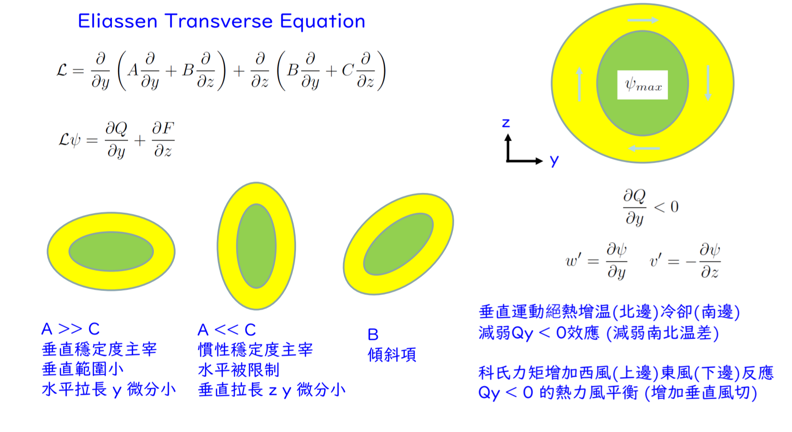

# Eliassen Secondary Circulation Coefficients (次環流方程式結構參數)

+++

## 證明目標:

透過聯立大氣的熱力與動力方程式，定義出決定次環流形狀的三個核心結構參數 $\rho A$、$\rho B$、$\rho C$：

1.  **$\rho A = \frac{g}{\theta_0}\frac{\partial\theta}{\partial z}$**
2.  **$\rho C = (f+\frac{2v}{r})(f+\zeta)$**
3.  **$\rho B = -\frac{g}{\theta_0}\frac{\partial\theta}{\partial r} = -(f+\frac{2v}{r})\frac{\partial v}{\partial z}$**

+++

## 假設與已知 (Assumptions & Preliminaries)

* **【已知 1】 [擾動場流體靜力平衡 (Hydrostatic Balance)](https://derek1403.github.io/Theory_Playground/_build/html/01_Derivations/Fluid_Dynamics_in_Cylindrical_Coordinates/Hydrostatic_Balance_for_Perturbations.html)：**
  
  $$\frac{\partial\phi}{\partial z} = \frac{g}{\theta_0}\theta$$

  * 此處的 $\theta$ 是 **雷諾分解後的位溫擾動** $\theta'$ ，但可以當總位溫 $\Theta= \theta_0(z) + \theta'$
    * $\frac{\partial \theta'}{\partial t} = \frac{\partial\Theta}{\partial t} $
    * $\frac{\partial \theta'}{\partial r} = \frac{\partial\Theta}{\partial r} $
    * $\frac{\partial \theta'}{\partial \lambda} = \frac{\partial\Theta}{\partial \lambda} $
    * 假設背景穩定度主導，$\frac{\partial\Theta}{\partial z} = \frac{\partial\theta_0}{\partial z} + \frac{\partial \theta'}{\partial z} \approx \frac{\partial\theta_0}{\partial z} = \frac{\partial\bar{\theta}}{\partial z}$
  * 為了避免誤會，我下面的證明會用 $\theta'$ 這種正確的表達方式(起初會有 $\theta$ 和 $\theta'$ 混用是因為前人 **懶+這樣寫太複雜了** ，但我不這麼想所以我們該加 $'$ 就加)

* **【已知 2】 [軸對稱熱力學能量方程式 (Thermodynamic Equation)](https://derek1403.github.io/Theory_Playground/_build/html/01_Derivations/Fluid_Dynamics_in_Cylindrical_Coordinates/Axisymmetric_Thermodynamic_Energy_Equation.html)：**
  
  $$\frac{\partial\theta}{\partial t} + u\frac{\partial\theta}{\partial r} + w\frac{\partial\theta}{\partial z} = \frac{\theta}{T}\frac{Q}{c_p}$$

* **【已知 3】 [梯度風平衡 (Gradient Wind Balance)](https://derek1403.github.io/Theory_Playground/_build/html/01_Derivations/Fluid_Dynamics_in_Cylindrical_Coordinates/Gradient_Wind_Balance.html)：**
  
  
  $$\begin{gather*}
  \frac{v^2}{r} + fv &=& \frac{\partial\phi}{\partial r} \\
  \frac{\partial}{\partial t}\left[\frac{v^2}{r} + fv\right] &=& \frac{\partial^2\phi}{\partial t\partial r} \\
  \frac{2v}{r}\frac{\partial v}{\partial t} + f\frac{\partial v}{\partial t} &=& \frac{\partial^2\phi}{\partial t\partial r} \\
  \left(f + \frac{2v}{r}\right)\frac{\partial v}{\partial t} &=& \frac{\partial^2\phi}{\partial t\partial r}
  \end{gather*}$$

  * 徑向動量的平衡

* **【已知 4】 [軸對稱切線動量方程式 (Axisymmetric Tangential Momentum Equation)](https://derek1403.github.io/Theory_Playground/_build/html/01_Derivations/Fluid_Dynamics_in_Cylindrical_Coordinates/Axisymmetric_Tangential_Momentum_Equation.html)：**

  $$\frac{\partial v}{\partial t}+u(f+\zeta)+w\frac{\partial v}{\partial z}=X$$

  * $X$ 為次網格尺度的切線方向摩擦力或動量強迫作用 $[\text{m} \cdot \text{s}^{-2}]$
  * 切線動量的平衡

* **【已知 5】 微積分偏導數可交換性 (Symmetry of Second Derivatives / Schwarz's Theorem)：**
  
  對於連續可微的重力位高度場 $\phi(r,z)$，先對 $z$ 微分再對 $r$ 微分，必定等於先對 $r$ 微分再對 $z$ 微分：

  $$\frac{\partial}{\partial r}\left[\frac{\partial\phi}{\partial z}\right] = \frac{\partial}{\partial z}\left[\frac{\partial\phi}{\partial r}\right]$$

* **【定義 1】 $\rho A$ 垂直穩定度 (Static Stability)：**
  
  $$\rho A \overset{\text{def}}{=} \frac{g}{\theta_0}\frac{\partial\theta}{\partial z}$$

* **【定義 2】 $\rho B_{\text{thermal}}$ 熱力風 (Thermal wind)：**
  
  $$\rho B_{\text{thermal}} \overset{\text{def}}{=} -\frac{g}{\theta_0}\frac{\partial\theta}{\partial r}$$

* **【定義 3】$\rho B_{\text{momentum}}$ 斜壓性(Baroclinicity)：**

  $$\rho B_{\text{momentum}} \overset{\text{def}}{=} -\left(f+\frac{2v}{r}\right)\frac{\partial v}{\partial z}$$

* **【定義 4】 $\rho C$ 慣性穩定度 (Inertial Stability)：**

  $$\rho C \overset{\text{def}}{=} \left(f+\frac{2v}{r}\right)(f+\zeta)$$

* **【定義 5】 熱力與動力強迫項 (Forcing Terms)：**
  為簡化方程式，定義等效熱力強迫 $J$ 與等效動力強迫 $F$：

  $$J \overset{\text{def}}{=} \frac{g}{\theta_0}\frac{\theta}{T}\frac{Q}{c_p}$$
  
  $$F \overset{\text{def}}{=} \left(f+\frac{2v}{r}\right)X$$

+++

## 證明:

我們將證明分為三個階段：熱力轉換、動力轉換、以及連接兩者的橋樑。

### 階段一：由熱力學推導 $\rho A$ 與 $\rho B$ 的熱力型態

目標：探討 **靜力平衡** 隨時間的演變

$$\begin{gather*}
\frac{\partial\phi}{\partial z} &\overset{\text{已知 1}}{=}& \frac{g}{\theta_0}\theta' \\
\frac{\partial}{\partial t}\left[\frac{\partial\phi}{\partial z}\right] &=& \frac{g}{\theta_0}\frac{\partial\theta'}{\partial t} \\
\frac{\partial}{\partial t}\left[\frac{\partial\phi}{\partial z}\right] &=& \frac{g}{\theta_0}\frac{\partial\theta}{\partial t} \\
\frac{\partial^2\phi}{\partial t\partial z} &\overset{\text{已知 2}}{=}& \frac{g}{\theta_0} \left( -u\frac{\partial\theta}{\partial r} - w\frac{\partial\theta}{\partial z} + \frac{\theta}{T}\frac{Q}{c_p} \right) \\
\frac{\partial^2\phi}{\partial t\partial z} &=& -u\left(\frac{g}{\theta_0}\frac{\partial\theta}{\partial r}\right) - w\left(\frac{g}{\theta_0}\frac{\partial\theta}{\partial z}\right) + \frac{g}{\theta_0}\frac{\theta}{T}\frac{Q}{c_p} \\
\frac{\partial^2\phi}{\partial t\partial z} +u\left(\frac{g}{\theta_0}\frac{\partial\theta}{\partial r}\right) + w\left(\frac{g}{\theta_0}\frac{\partial\theta}{\partial z}\right)&=&   \frac{g}{\theta_0}\frac{\theta}{T}\frac{Q}{c_p} \\
\frac{\partial^2\phi}{\partial t\partial z} +u\rho A - w\rho B_{\text{thermal}}&\overset{\text{定義 1,2}}{=}&   \frac{g}{\theta_0}\frac{\theta}{T}\frac{Q}{c_p} \\
\frac{\partial^2\phi}{\partial t\partial z} +u\rho A - w\rho B_{\text{thermal}}&\overset{\text{定義 5}}{=}&   J &\quad \text{--- (式 I)}\\
\end{gather*}$$

+++

### 階段二：由動力學推導 $\rho C$ 與 $\rho B$ 的動力型態

目標：探討 **梯度風平衡** 隨時間的演變代入 **切線動量方程式**

$$\begin{gather*}
\frac{\partial v}{\partial t} + u(f+\zeta) + w\frac{\partial v}{\partial z} &\overset{\text{已知 4}}{=}& X \\
\left(f+\frac{2v}{r}\right)\frac{\partial v}{\partial t} + u\left(f+\frac{2v}{r}\right)(f+\zeta) + w\left(f+\frac{2v}{r}\right)\frac{\partial v}{\partial z} &=& \left(f+\frac{2v}{r}\right)X \\
\quad \quad \quad \quad\frac{\partial^2\phi}{\partial t\partial r} + u\left(f+\frac{2v}{r}\right)(f+\zeta) + w\left(f+\frac{2v}{r}\right)\frac{\partial v}{\partial z} &\overset{\text{已知 3}}{=}& \left(f+\frac{2v}{r}\right)X \\
\frac{\partial^2\phi}{\partial t\partial r} - u\rho B_{\text{momentum}} + w \rho C &\overset{\text{定義 3,4}}{=}& \left(f+\frac{2v}{r}\right)X\\
\frac{\partial^2\phi}{\partial t\partial r} - u\rho B_{\text{momentum}} + w \rho C &\overset{\text{定義 5}}{=}& F &\quad \text{--- (式 II)}
\end{gather*}$$

+++

### 階段三：熱力風平衡 (Thermal Wind Balance) 證明 $\rho B$ 的一致性

在式 I 與式 II 中，我們定義了兩個版本的 $\rho B$ ，大自然應該要是和諧的，我們現在用證明它們實際上是同一個東西

$$\begin{gather*}
\frac{\partial}{\partial r}\left[\frac{\partial\phi}{\partial z}\right] &\overset{\text{已知 5}}{=}& \frac{\partial}{\partial z}\left[\frac{\partial\phi}{\partial r}\right] \\
\frac{\partial}{\partial r}\left[\frac{g}{\theta_0}\theta'\right] &\overset{\text{已知 1,3}}{=}& \frac{\partial}{\partial z}\left[\frac{v^2}{r} + fv\right] \\
\frac{g}{\theta_0}\frac{\partial\theta'}{\partial r} &=& \frac{2v}{r}\frac{\partial v}{\partial z} + f\frac{\partial v}{\partial z} \\
\frac{g}{\theta_0}\frac{\partial\theta'}{\partial r} &=& \left(f + \frac{2v}{r}\right)\frac{\partial v}{\partial z}\\
\frac{g}{\theta_0}\frac{\partial\theta}{\partial r} &=& \left(f + \frac{2v}{r}\right)\frac{\partial v}{\partial z}\\
-\frac{g}{\theta_0}\frac{\partial\theta}{\partial r} &=& -\left(f + \frac{2v}{r}\right)\frac{\partial v}{\partial z}\\
\rho B_{\text{thermal}}&\overset{\text{定義 2,3}}{=}&  \rho B_{\text{momentum}} &\equiv \rho B
\end{gather*}$$

---

+++

## 物理解釋

這三個結構參數（$\rho A, \rho B, \rho C$）代表了颱風（渦旋系統）抵抗外界干擾的 **「剛性 (Stiffness)」或「穩定度」**。

### 1. $\rho A$: 垂直穩定度 (Static Stability)
* **公式**: $\rho A = \frac{g}{\theta_0}\frac{\partial\theta}{\partial z}$
* **物理直覺**: 它是大氣的「垂直彈簧」，當次環流的上升氣流 $w$ 試圖往上衝時，如果環境位溫隨高度遞增得很快（$\rho A$ 很大），空氣塊就會感受到強大的負浮力把他拉回原位。 $\rho A$ 越大，系統越難產生深對流。這與直角座標中的布氏頻率平方 $N^2$ 完全等價。
* $A = \frac{\partial\overline{b}}{\partial z} = N^2$，也就是布蘭特-維賽拉頻率（Brunt-Väisälä Frequency）的平方

### 2. $\rho C$: 慣性穩定度 (Inertial Stability)
* **公式**: $\rho C = \left(f+\frac{2v}{r}\right)(f+\zeta)$
* **物理直覺**: 它是大氣的「水平彈簧」。前項 $\left(f+\frac{2v}{r}\right)$ 是「絕對角速度的兩倍」，後項 $(f+\zeta)$ 是「絕對渦度」。當次環流的徑向風 $u$ 試圖把空氣塊往內推時，會受到科氏力與離心力改變所產生的反作用力。在強烈颱風的眼牆（切線風 $v$ 極大，渦度 $\zeta$ 極大），$\rho C$ 會是一個超級大的正值，這意味著眼牆像一道堅不可摧的無形氣牆，很難被水平氣流穿透。

### 3. $\rho B$: 斜壓性 / 熱力風 耦合
* **公式**: $\rho B = -\frac{g}{\theta_0}\frac{\partial\theta}{\partial r} = -\left(f+\frac{2v}{r}\right)\frac{\partial v}{\partial z}$
* **物理直覺**: 它代表水平溫度梯度（熱力），必然伴隨著垂直風切（動力），它告訴我們：次環流的推動（$u, w$）不是正交獨立的！當系統內部存在徑向溫度差異時，垂直運動與水平運動必須「傾斜地」互相配合，才能確保系統在演變過程中，永遠死死咬住「熱力風平衡」。

+++
